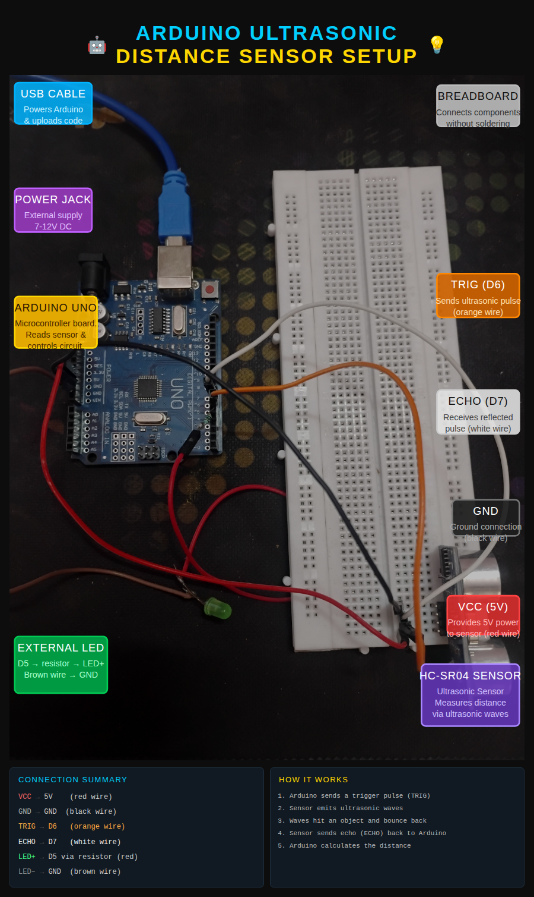
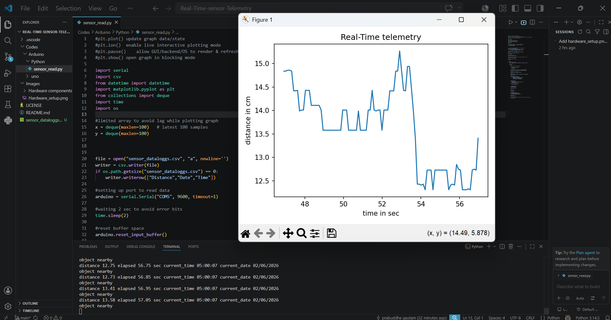
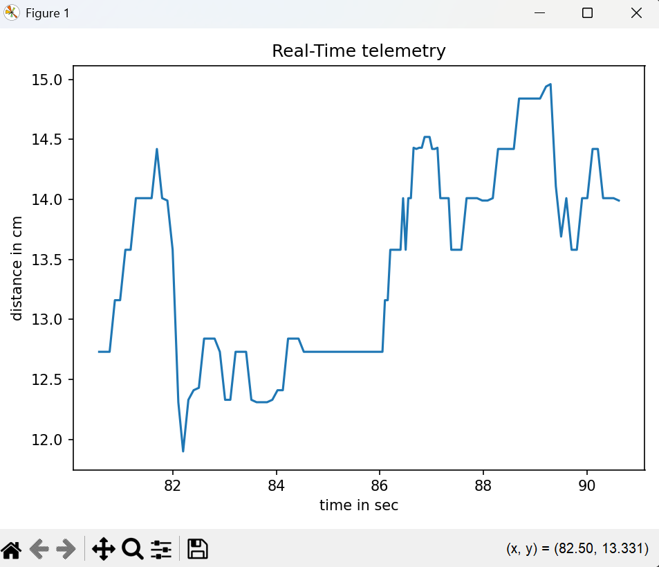

# Real-Time-sensor-Telemetry
## Project Overview
```text
This project demonstrates a complete telemetry pipeline using Arduino and Python.
The ultrasonic sensor measures distance and sends the data to the computer through UART serial communication. 
Python receives the sensor data, processes it, applies decision logic, stores the readings in a CSV file 
for future analysis, and plots the distance values in real time using Matplotlib.
This project combines embedded systems, serial communication, data logging, and real-time visualization.
```
## Hardware Setup



## Hardware Used

```text
- Arduino Uno
- HC-SR04 Ultrasonic Sensor
- Breadboard
- 5mm LED
- Resistor
- Jumper Wires
```
## Software Used

```text
- Arduino IDE
- Python
- PySerial
- Matplotlib
- VS Code
```
## System Workflow

```text
HC-SR04
   ↓
Arduino Uno
   ↓ UART
Python
   ↓
CSV Logging
   ↓
Real-Time Graph
```
## Real-Time Output

------------------------------------------------


## Folder Structure

```text
Real-Time-sensor-Telemetry
│
├── .vscode
│   └── settings.json
│
├── Codes
│   ├── Arduino
│   │   └── uno
│   │       └── Ultrasonic_Uno.ino
│   │
│   └── Python
│       └── sensor_read.py
│
├── Images
│   ├── Graphs
│   │   ├── Graph 0.png
│   │   └── Graph 1.png
│   │
│   ├── Hardware components
│   │   ├── Led 5mm.jpg
│   │   ├── Resistor & breadboard.jpg
│   │   ├── sonic_sensor.webp
│   │   └── uno.webp
│   │
│   └── Hardware_setup.png
│
├── sensor_dataloggs.csv
├── README.md
└── LICENSE
```
## How to Run
```text
1. Upload Ultrasonic_Uno.ino to Arduino Uno.
2. Connect Arduino to PC.
3. Install required Python libraries:
4. Run python sensor_read.py
```